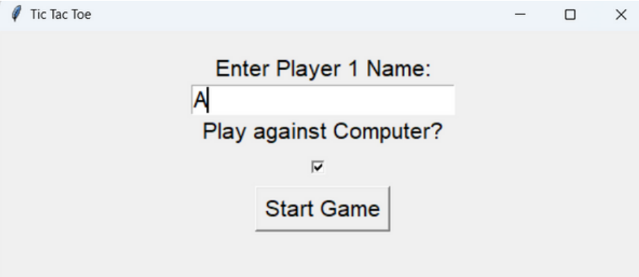
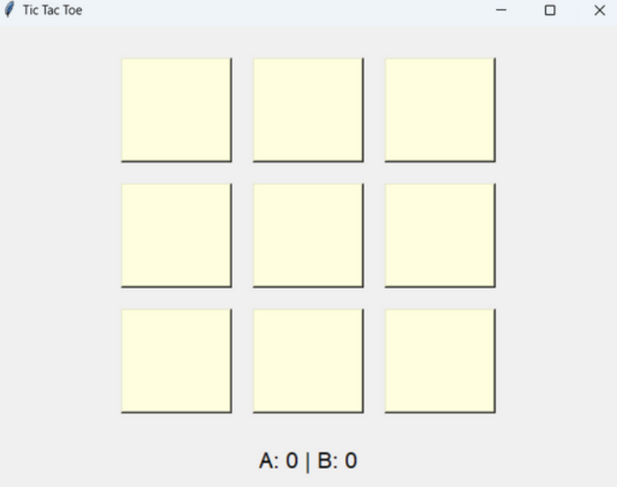
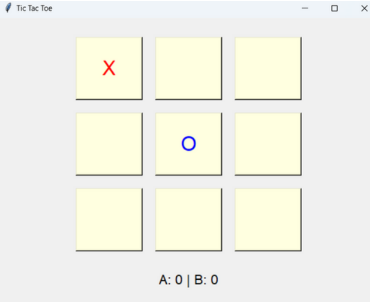
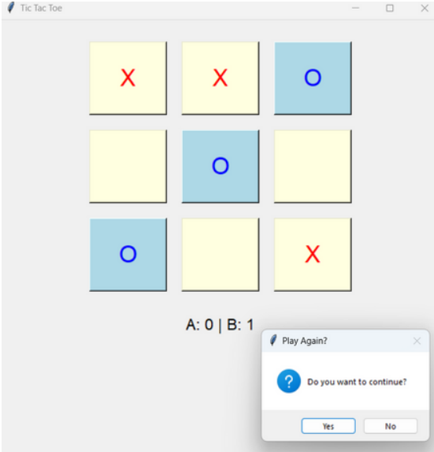
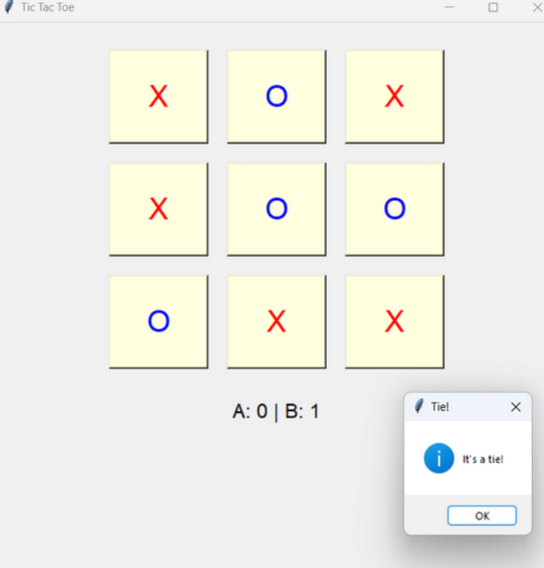
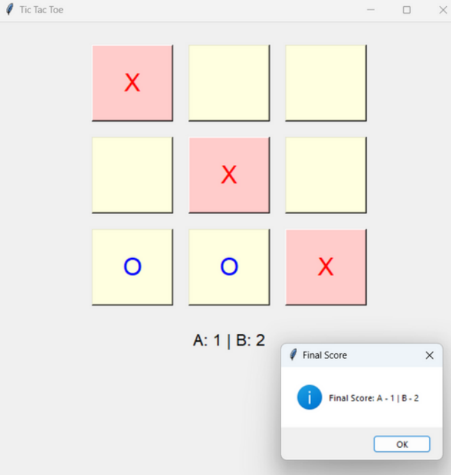

## Screenshots

### 1. Player 1 Name Input and Bot Selection
*Input the name of Player 1 and select whether to play against the bot.*

---

### 2. Game Start - Empty Grid Display
*An empty grid is shown when the game starts.*

---

### 3. Game Commencement
*The game grid once the gameplay has commenced.*

---

### 4. Win Prompt with Replay Option
*Player 2 wins, with an option to continue or end the game.*

---

### 5. Tie Result Display
*Display when the game results in a tie.*

---

### 6. Final Score After Multiple Rounds
*Final score shown after multiple rounds.*

